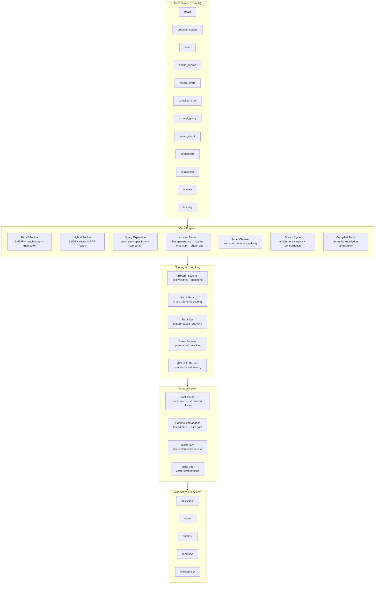
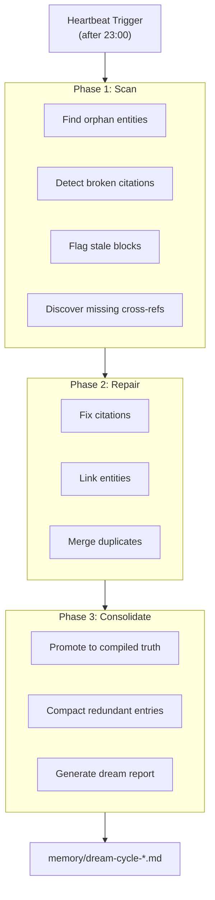

# Architecture

## Overview

mind-mem is a persistent, auditable, contradiction-safe memory system for coding agents. It provides BM25F-based retrieval with graph boost, fact indexing, and adaptive cutoff.

## System Architecture



## Query Pipeline


## Dream Cycle (Nightly Enrichment)



## Compiled Truth Pipeline

```
┌─────────────────────────────────────────────┐
│                 MCP Server                   │
│              (mcp_server.py)                 │
├──────────┬──────────┬──────────┬────────────┤
│  recall  │ propose  │  scan    │  hybrid    │
│  engine  │ update   │  engine  │  search    │
├──────────┴──────────┴──────────┴────────────┤
│              Block Parser                    │
│           (block_parser.py)                  │
├─────────────────────────────────────────────┤
│              Workspace FS                    │
│    decisions/ tasks/ entities/ memory/       │
└─────────────────────────────────────────────┘
```

## Core Modules

### Recall Engine (`_recall_core.py`)
Main BM25F pipeline. Loads blocks from workspace, tokenizes query, scores candidates, applies boosts, reranks, and returns top-K results with adaptive knee cutoff.

### Block Parser (`block_parser.py`)
Parses markdown files into structured blocks. Each block has an ID, type, statement, and optional metadata fields.

### Tokenization (`_recall_tokenization.py`)
Handles text tokenization with stemming, stopword removal, and Unicode normalization.

### Query Detection (`_recall_detection.py`)
Classifies query intent (WHAT/WHEN/WHO/HOW/WHY), detects skeptical queries, extracts field tokens, and handles query decomposition.

### Scoring (`_recall_scoring.py`)
BM25F scoring with field weights, cross-reference graph building, date scoring, and weighted term frequency computation.

### Reranking (`_recall_reranking.py`)
Deterministic reranking of BM25 candidates using feature-based scoring.

### Context Packing (`_recall_context.py`)
Formats retrieved blocks into context strings for LLM consumption.

### Query Expansion (`_recall_expansion.py`)
Expands queries with synonyms, month name variants, and RM3 pseudo-relevance feedback.

### Temporal Filtering (`_recall_temporal.py`)
Resolves time references ("today", "last week") and applies temporal filters to results.

### MIND FFI (`mind_ffi.py`)
Interface to MIND scoring kernels for customizable BM25 parameter overrides.

## Data Flow

1. Query arrives via MCP tool call
2. Query type detected and expanded
3. Blocks loaded from workspace files
4. BM25F scoring applied with field weights
5. Graph boost, entity boost, and other boosters applied
6. Reranking refines candidate ordering
7. Knee cutoff determines final result count
8. Context packed and returned to caller

## Storage

All data is stored as plain markdown files in the workspace directory. No external database required (zero dependencies).
