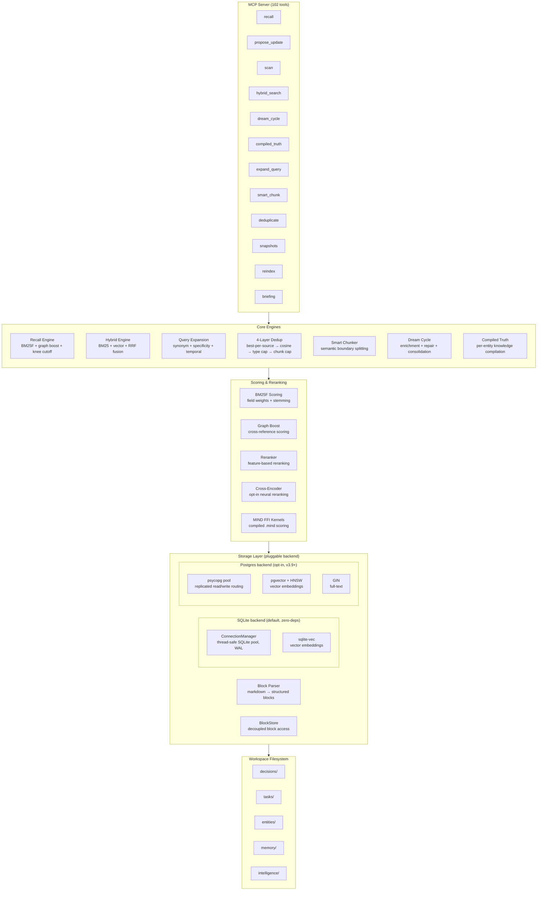
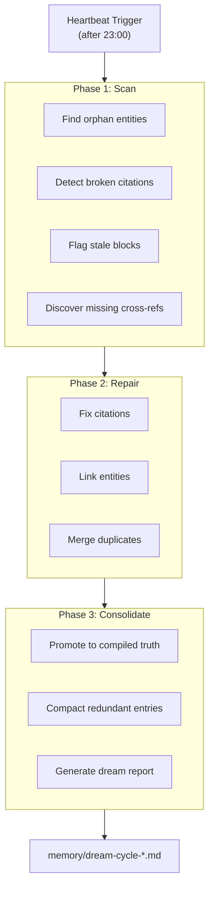
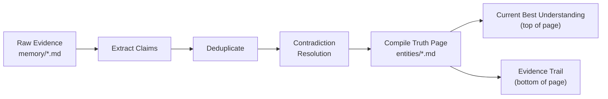
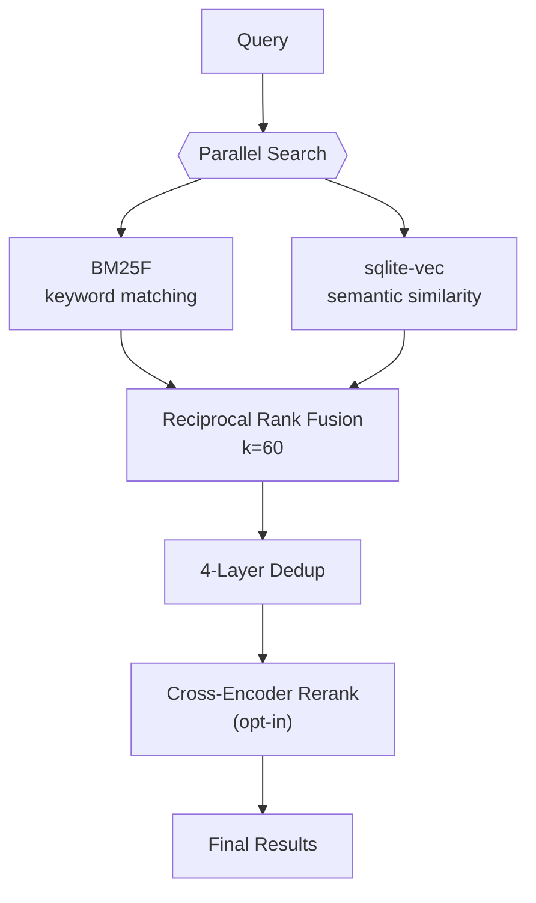

# Architecture

## Overview

MIND-Mem is a persistent, auditable, contradiction-safe memory system for coding agents. It provides BM25F-based retrieval with graph boost, fact indexing, and adaptive cutoff.

## System Architecture

```mermaid
graph TB
    subgraph MCP["MCP Server (102 tools)"]
        direction LR
        recall[recall]
        propose[propose_update]
        scan[scan]
        hybrid[hybrid_search]
        dream[dream_cycle]
        truth[compiled_truth]
        expand[expand_query]
        chunk[smart_chunk]
        dedup_tool[deduplicate]
        snapshot[snapshots]
        reindex[reindex]
        briefing[briefing]
    end

    subgraph Engine["Core Engines"]
        direction TB
        RE["Recall Engine<br/>BM25F + graph boost + knee cutoff"]
        HE["Hybrid Engine<br/>BM25 + vector + RRF fusion"]
        QE["Query Expansion<br/>synonym + specificity + temporal"]
        DD["4-Layer Dedup<br/>best-per-source → cosine → type cap → chunk cap"]
        SC["Smart Chunker<br/>semantic boundary splitting"]
        DC["Dream Cycle<br/>enrichment + repair + consolidation"]
        CT["Compiled Truth<br/>per-entity knowledge compilation"]
    end

    subgraph Scoring["Scoring & Reranking"]
        BM["BM25F Scoring<br/>field weights + stemming"]
        GR["Graph Boost<br/>cross-reference scoring"]
        RR["Reranker<br/>feature-based reranking"]
        XR["Cross-Encoder<br/>opt-in neural reranking"]
        MIND["MIND FFI Kernels<br/>compiled .mind scoring"]
    end

    subgraph Storage["Storage Layer (pluggable backend)"]
        BP["Block Parser<br/>markdown → structured blocks"]
        BS["BlockStore<br/>decoupled block access"]
        subgraph SQLiteBE["SQLite backend (default, zero-deps)"]
            CM["ConnectionManager<br/>thread-safe SQLite pool, WAL"]
            VEC["sqlite-vec<br/>vector embeddings"]
        end
        subgraph PGBE["Postgres backend (opt-in, v3.9+)"]
            PGCONN["psycopg pool<br/>replicated read/write routing"]
            PGVEC["pgvector + HNSW<br/>vector embeddings"]
            PGGIN["GIN<br/>full-text"]
        end
    end

    subgraph FS["Workspace Filesystem"]
        decisions["decisions/"]
        tasks["tasks/"]
        entities["entities/"]
        memory["memory/"]
        intelligence["intelligence/"]
    end

    MCP --> Engine
    Engine --> Scoring
    Scoring --> Storage
    Storage --> FS
```

## Query Pipeline

```mermaid
flowchart LR
    Q["Query"] --> ID["Intent Detection<br/>WHAT/WHEN/WHO/HOW/WHY"]
    ID --> QX["Query Expansion<br/>multi-query + RM3"]
    QX --> BM["BM25F Scoring<br/>field weights"]
    BM --> GB["Graph Boost<br/>+ entity boost"]
    GB --> RR["Reranking"]
    RR --> DD["4-Layer Dedup"]
    DD --> KC["Knee Cutoff"]
    KC --> CP["Context Pack"]
    CP --> R["Results"]

    style Q fill:#2d5a27,stroke:#4a8c3f,color:#fff
    style R fill:#2d5a27,stroke:#4a8c3f,color:#fff
```

## Dream Cycle (Nightly Enrichment)

```mermaid
flowchart TB
    trigger["Heartbeat Trigger<br/>(after 23:00)"] --> scan_phase["Scan Phase"]

    subgraph scan_phase["Phase 1: Scan"]
        orphans["Find orphan entities"]
        broken["Detect broken citations"]
        stale["Flag stale blocks"]
        missing["Discover missing cross-refs"]
    end

    scan_phase --> repair["Phase 2: Repair"]

    subgraph repair["Phase 2: Repair"]
        fix_cite["Fix citations"]
        link_entities["Link entities"]
        merge_dupes["Merge duplicates"]
    end

    repair --> consolidate["Phase 3: Consolidate"]

    subgraph consolidate["Phase 3: Consolidate"]
        promote["Promote to compiled truth"]
        compact["Compact redundant entries"]
        report["Generate dream report"]
    end

    consolidate --> log["memory/dream-cycle-*.md"]
```

## Compiled Truth Pipeline

```mermaid
flowchart LR
    raw["Raw Evidence<br/>memory/*.md"] --> extract["Extract Claims"]
    extract --> dedup["Deduplicate"]
    dedup --> resolve["Contradiction<br/>Resolution"]
    resolve --> compile["Compile Truth Page<br/>entities/*.md"]
    compile --> current["Current Best Understanding<br/>(top of page)"]
    compile --> trail["Evidence Trail<br/>(bottom of page)"]
```

## Hybrid Search Architecture

```mermaid
flowchart TB
    query["Query"] --> split{{"Parallel Search"}}
    split --> bm25["BM25F<br/>keyword matching"]
    split --> vec["sqlite-vec<br/>semantic similarity"]

    bm25 --> rrf["Reciprocal Rank Fusion<br/>k=60"]
    vec --> rrf

    rrf --> dedup["4-Layer Dedup"]
    dedup --> rerank["Cross-Encoder Rerank<br/>(opt-in)"]
    rerank --> results["Final Results"]
```

## Ledgers and chains

"The audit chain" is four different files, and this document did not name any
of them — it contained zero occurrences of `hash_chain_v2`, `evidence_chain`,
`audit_sidecar` or `served_ledger` while the README said "audit chain" four
times for whichever one it meant. A reader could not tell which artifact a
claim was about, which is the same as having no architecture document for the
part of the system the product's differentiator rests on.

`verify_cli.LEDGER_CHECKS` is the authority for this list, and
`tests/test_docs_alignment.py::TestArchitectureNamesEveryLedger` fails the
build if a ledger is added there and not described here.

| Row | Artifact | What it records | Failure exit code |
| --- | --- | --- | --- |
| `hash_chain` | `memory/hash_chain_v2.db` | The SHA3-512 append-only chain of record: **what the gate admitted**. Q16.16 fixed-point in the hash preimage, byte-identical across architectures. | 2 |
| `evidence_chain` | `memory/evidence_chain.jsonl` | Structured governance evidence: **why** an admission was allowed, and by whom. | 4 |
| `audit_sidecar` | `.mind-mem-audit/chain.jsonl` | The field-granular sidecar (`audit_chain.py`) — which fields of a block changed, per operation. | 7 |
| `served_ledger` | `.mind-mem-ledger/served.jsonl` | **What recall actually served** (`served_ledger.py`): one append-only row per served run, no verdict and no score. On by default since 5.0.2. | 8 |

They are separate on purpose and are not interchangeable: the first says a
write landed, the second says it was allowed, the third says which fields
moved, and the fourth says what a reader was later shown. A verification that
walked one and reported on "the audit chain" would be answering a different
question from the one asked.

Further rows in the same report are **not** ledgers
(`verify_cli.NON_LEDGER_CHECKS`): `spec_binding` compares the live
`mind-mem.json` against its attestation, `open_scopes` asks the evidence
ledger which write scopes opened and never recorded a close (exit code 9),
and `evidence_archives` re-hashes each recovery archive named by a live
anchor. A workspace with no recovery anchor reports that absence; once an
anchor exists, a missing, changed, or unreadable archive fails with exit 4.

### When the evidence chain forks

`EvidenceChain._load_from_file` stops at the first record it cannot trust and
leaves the in-memory chain **empty** — deliberately, so a verified prefix
never passes for the whole history. `create()` then refuses, because
appending to a chain with no trustworthy tail would take the genesis hash as
its parent and root a second chain behind the untrusted one, and the whole
history would stop verifying rather than merely its tail.

The refusal is correct and it is also a dead end, so recovery exists —
`evidence_recovery`, surfaced as `mm chain survey` / `mm chain recover`. It
does not repair. `_freeze_and_raise` states the rule the design obeys —
*"repairing the history by rewriting hashes is never this code's decision"* —
so recovery **seals** instead:

1. Survey the file end to end (the loader stops at break one; a census must
   not) and classify every break.
2. Archive the damaged file byte-for-byte to a timestamped sibling, proven
   faithful by digest before anything else is touched, and left read-only.
   The name matches `corpus_registry.LEDGER_PATTERNS`, so a snapshot still
   refuses to carry it off — an archived ledger is a ledger.
3. Replace the store with a single anchor record linked from the genesis
   hash, carrying the archive's sha256 as its `payload_hash` and the record
   count, head hash and break census in `metadata` (which the v3 preimage
   covers, so the census is tamper-evident too). The same hashed metadata
   explicitly records `continues_predecessor_chain: false` and
   `predecessor_trust_restored: false`.

No stored hash is rewritten and no record is dropped or reordered. The
archive keeps failing to verify with the message it failed with before; the
new segment verifies from its own genesis. The break becomes permanent and
citable instead of disappearing — which is why the operation is explicit,
reachable from no read path, and refused on a chain that verifies clean.
For an operator-approved recovery, `--expect-sha256` pins the reviewed source
digest and is checked again under the canonical append lock before any archive
or pending segment is created.

One consequence to expect: `landed_block_ids` derives its answer from the
CLOSE records in the *live* chain, so those move into the archive with
everything else. On a chain that was already unloadable this costs nothing
(an unloadable chain already reported zero landed ids), but on a recovered
workspace `mind-mem-verify`'s `unanchored_blocks` row is answered by
`mm anchor --apply`, not by the recovery.

## Components

## Core Modules

### Recall Engine (`_recall_core.py`)
Main BM25F pipeline. Loads blocks from workspace, tokenizes query, scores candidates, applies boosts, reranks, and returns top-K results with adaptive knee cutoff.

### Block Parser (`block_parser.py`)
Parses markdown files into structured blocks. Each block has an ID, type, statement, and optional metadata fields.

### Tokenization (`_recall_tokenization.py`)
Handles text tokenization with stemming, stopword removal, and Unicode normalization.

### Query Detection (`_recall_detection.py`)
Classifies query intent (WHAT/WHEN/WHO/HOW/WHY), detects skeptical queries, extracts field tokens, and handles query decomposition.

### Scoring (`_recall_scoring.py`)
BM25F scoring with field weights, cross-reference graph building, date scoring, and weighted term frequency computation.

### Reranking (`_recall_reranking.py`)
Deterministic reranking of BM25 candidates using feature-based scoring.

### Context Packing (`_recall_context.py`)
Formats retrieved blocks into context strings for LLM consumption.

### Query Expansion (`_recall_expansion.py`)
Expands queries with synonyms, month name variants, and RM3 pseudo-relevance feedback.

### Temporal Filtering (`_recall_temporal.py`)
Resolves time references ("today", "last week") and applies temporal filters to results.

### MIND FFI (`mind_ffi.py`)
Interface to MIND scoring kernels for customizable BM25 parameter overrides.

### Query Expansion (`query_expansion.py`)
LLM-free multi-query expansion. Generates semantically diverse reformulations (synonym expansion, specificity shifts, temporal rephrasing, negation variants) and fuses results with RRF.

### Compiled Truth (`compiled_truth.py`)
Per-entity knowledge compilation. Maintains current-best-understanding with timestamped evidence trail. Detects contradictions across evidence entries and flags conflicts for resolution.

### Dream Cycle (`dream_cycle.py`)
Autonomous memory enrichment engine. Scans for missing cross-references, broken citations, orphan entities, and consolidation opportunities. Generates repair proposals and compacts redundant entries.

### Search Deduplication (`dedup.py`)
4-layer post-retrieval dedup: best-chunk-per-source, cosine similarity dedup (>0.85), type diversity capping, and per-source chunk limiting.

### Smart Chunker (`smart_chunker.py`)
Content-aware chunking at semantic boundaries (headers, paragraphs, code blocks) instead of fixed character counts. Format-specific splitting for markdown, code, and prose.

## Data Flow

1. Query arrives via MCP tool call
2. Query type detected and expanded (multi-query expansion if enabled)
3. Blocks loaded from workspace files
4. BM25F scoring applied with field weights
5. Graph boost, entity boost, and other boosters applied
6. Reranking refines candidate ordering
7. 4-layer deduplication removes redundant results
8. Knee cutoff determines final result count
9. Context packed and returned to caller

## Storage

All data is stored as plain markdown files in the workspace directory. No external database required (zero dependencies).
